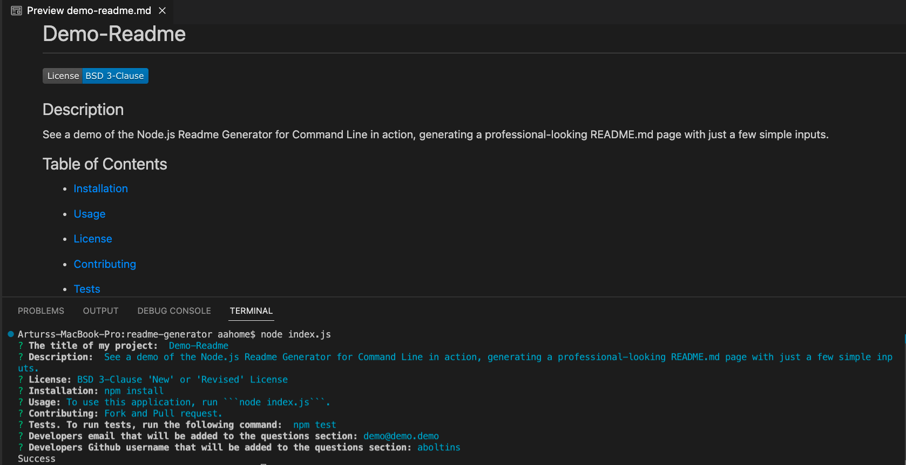
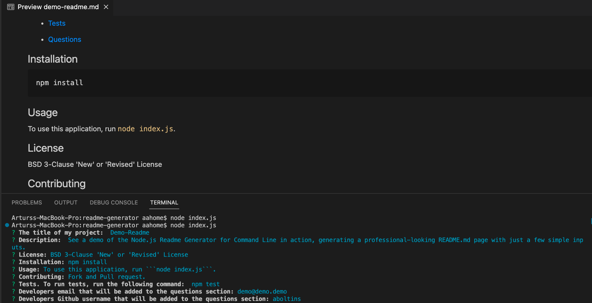
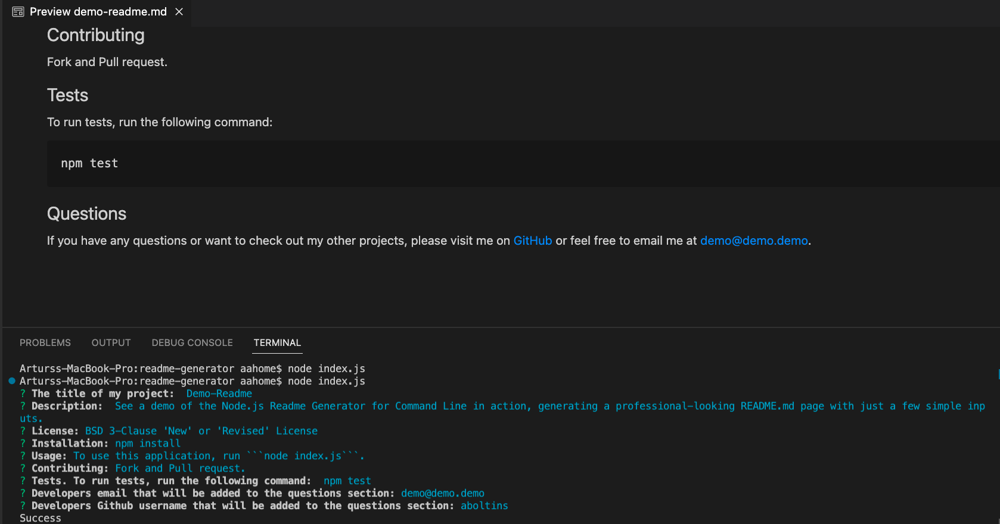

# Readme-Generator

[](https://opensource.org/licenses/MIT)

## Description

This is a Node.js command-line application that generates a README file for a project. It prompts the user with a series of questions about the project such as its title, description, license, installation, usage, contributing, tests, email, and GitHub username. It then uses the user's input to dynamically generate a README file in Markdown format and writes the file to the file system.

The application uses the inquirer package to prompt the user with questions and obtain their responses. The responses are then passed to a generateMarkdown function that dynamically generates the Markdown content for the README file based on the user's responses.

The generated README file includes a table of contents with links to each section, a section for installation instructions, a section for usage instructions, a section for the license, a section for contributing guidelines, a section for testing instructions, and a section for contact information.

The user can also choose from a list of most common open source licenses, and the application dynamically generates the appropriate license badge for the selected license. 

## Table of Contents

  * [Installation](#installation)

  * [Usage](#usage)

  * [License](#license)

  * [Contributing](#contributing)

  * [Tests](#tests)

  * [Questions](#questions)

## Installation

    npm install

## Usage

To use this application, run ```node index.js``` in your terminal.

## License

MIT License

## Contributing

Fork and pull request.

## Tests

To run tests, run the following command:

    npm test

## Screenshots





## Questions

If you have any questions or want to check out my other projects, please visit me on [GitHub](https://github.com/aboltins) or feel free to email me at <arthuraboltins@gmail.com>.
